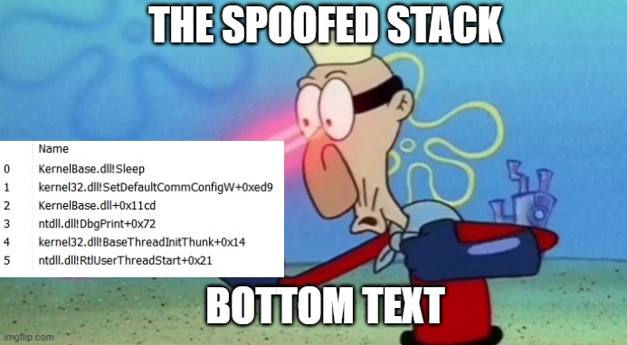
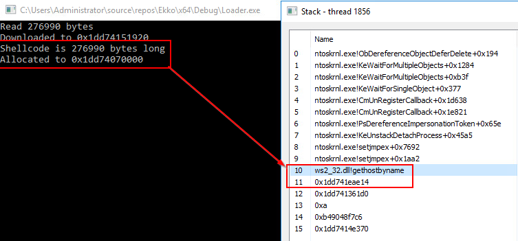
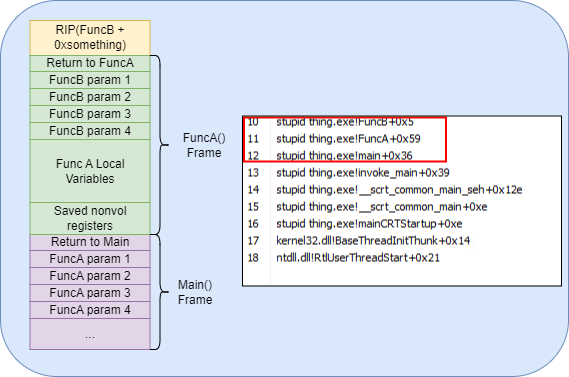
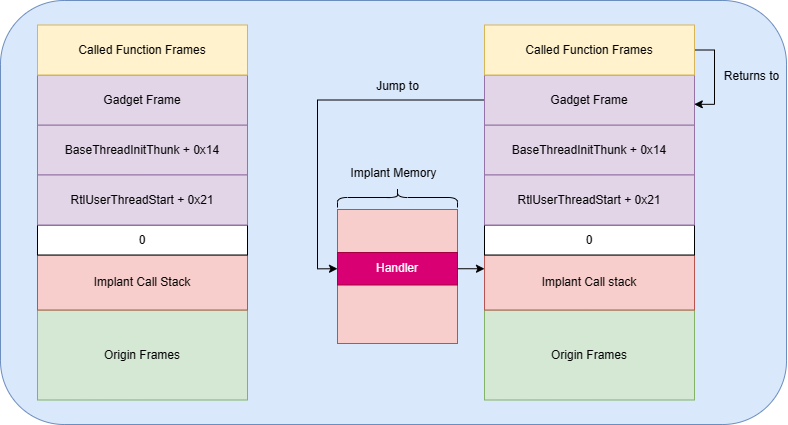
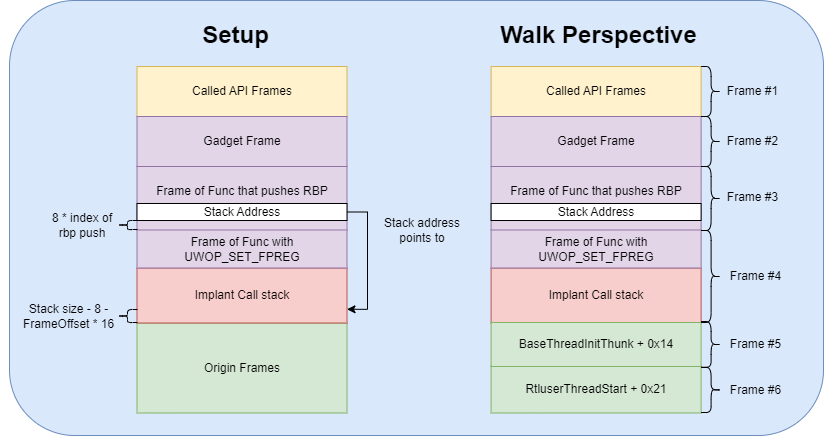
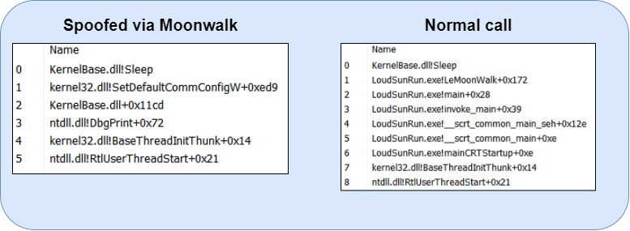

<br/>
Stack spoofing is a really cool malware technique that isn't new, but has been receving some more attention recently. The goal of this post is to introduce readers to the concept and dive into two implementations. This post will focus only on call stack spoofing in x64 Windows with "active" spoofing techniques. 

# Preface
None of the work here is novel. The majority of the stack spoofing research that I will be describing was done by [Klezvirus](https://twitter.com/klezvirus), [trickster012](https://twitter.com/trickster012), [waldo-irc](https://twitter.com/waldoirc), and [namaszo](https://twitter.com/namaszo). Massive thanks to them for providing the foundation for me to dig into such a cool topic.

During my internship at X-Force Red I got to work with [0xboku](https://twitter.com/0xboku) in researching the work above. Some of that work got to be integrated with [BokuLoader](https://github.com/boku7/BokuLoader), which was really awesome. Without Bobby's help I wouldn't have been able to understand these techniques as much, so massive thanks to him for sticking through several hour calls with my dumb questions.

Lastly, I am not an expert on this subject, this post is meant to just share what I understand with others trying to cook funny software.

# Introduction
EDR have more capabilities beyond inline hooking. It is possible for them to utilize the call stack of a function call to determine whether a function is malicious or not. [Elastic has demonstrated this capability](https://www.elastic.co/security-labs/upping-the-ante-detecting-in-memory-threats-with-kernel-call-stacks) and I am guessing this call stack telemetry is obtained via kernel callbacks registered for process and thread creation events, and probably more.

<details style="background-color: #000000; color: #FFFFFF; border-left: 5px solid #00FF00; border-radius: 10px; padding: 10px;">
  <summary>Call stack?</summary>
  <p>Every thread in a process has its own call stack. When a function is called, a frame is created for it; this frame is a space for it store some data for that function, like local variables. Right below the base of the frame contains a return address; the location of the frame's caller. This way, when the function finishes execution, it can return to its caller.
  </p>
</details>

Using a debugger, we can place breakpoints on some function calls and view our call stack. When our implant (in my case, meterpreter), makes a function call (`gethostbyname` in the screenshot below), we can see that the call stack points back to its location in memory. 



A little note: the most recent caller is higher in the stack (lower number), each entry you go down is the above entry's caller. The additional addresses beyond the meterpreter return address are "leaked" stack values; when unbacked memory is encountered by a walk, it assumes the stack frame is just of size 8, causing it to just dump stack values until it encounters a 0.

<details style="background-color: #000000; color: #FFFFFF; border-left: 5px solid #00FF00; border-radius: 10px; padding: 10px;">
  <summary>The size and the allocation don't line up!</summary>
  <p>Yeah lol, that's just a consequence of my janky meterpreter reflective loader that cannot free itself due to IAT hooks that are defined within the loader. gethostbyname was called by meterpreter.
  </p>
</details>

From here, EDR could:
* Kill our implant because that address is RX (Read-Executable) memory unbacked by a file on disk
* Run a memory scan and kill our implant because it will probably get flagged
* Flag our process to warrant more investigation by an IR operator
* Some other voodoo

This is not ideal. So how can we address this? We can try spoofing our callstack; making it less suspicious by attempting to hide the source of our call. There are multiple ways to achieve this; this blog post will not cover all of them.

# Active Spoofing vs Passive Spoofing
The techniques I will introducing fall under the "active" category; that is, they allow for the spoofing of any function being called. See the following projects:
* [VulcanRaven](https://github.com/WithSecureLabs/CallStackSpoofer)
* [AceLdr](https://github.com/kyleavery/AceLdr/blob/main/src/asm/spoof.asm)'s ret addr spoofing 

Passive spoofing is something I sort of went over in my previous blog post and it is a type of spoofing that can only occur when the implant is sleeping. See the following projects:
* [ThreadStackSpoofer](https://github.com/mgeeky/ThreadStackSpoofer)
* [CallStackMasker](https://github.com/Cobalt-Strike/CallStackMasker)
* [Unwinder](https://github.com/Kudaes/Unwinder)
* [TitanLdr](https://github.com/realoriginal/titanldr-ng/blob/master/Obf.c)'s sleep technique. This was also implemented in AceLdr

The active spoofing techniques I am covering have been done by the [SilentMoonwalk](https://github.com/klezVirus/SilentMoonwalk/tree/master) project.

# x64 Call Stack Primer
Unlike x86, only the RSP is necessary for keeping track of stack frames. Take the following code
```
  void FuncC()
  {
      return;
  }
  void FuncB(int a, int b, int c, int d)
  {
      FuncC();
      return;
  }
  int FuncA(int a, int b, int br, int uh)
  {
      int c = a;
      int d = b;
      FuncB(1, 1, 1, 1);
      return 5;
  }
  void main()
  {
      FuncA(1, 2, 3, 4);
  }
```
The contents of the call stack when FuncB() is called is below on the left. The Process Hacker stack walk view is on the right.
<br>


The space between the return addresses (the "Return to X") is what I will refer to as the "stack size" of a function. Understanding how to calculate this stack size will be important for trying to spoof stacks as it is a common attribute utilized when unwinding the stack.

# The .pdata section and unwind codes
The .pdata section is a PE section which includes information to assist with exception handling. More specifically, it is an array of `RUNTIME_FUNCTION`s.
```
typedef struct _IMAGE_RUNTIME_FUNCTION_ENTRY {
  DWORD BeginAddress;
  DWORD EndAddress;
  union {
    DWORD UnwindInfoAddress;
    DWORD UnwindData;
  } DUMMYUNIONNAME;
} RUNTIME_FUNCTION
```

The `BeginAddress` and `EndAddress` are offsets to the base of the PE. The actual code for the function this `RUNTIME_FUNCTION` belongs to is between those addresses. The union contains the interesting bit; an offset to the `UNWIND_INFO` struct.

```
typedef struct _UNWIND_INFO {
    BYTE Version : 3;
    BYTE Flags : 5;
    BYTE SizeOfProlog;
    BYTE CountOfCodes;
    BYTE FrameRegister : 4;
    BYTE FrameOffset : 4;
    UNWIND_CODE UnwindCode[1];
} UNWIND_INFO, * PUNWIND_INFO;
```

This `UNWIND_INFO` contains an array of `UNWIND_CODE`s. We can iterate through these to calculate the stack size of the function.

```
typedef union _UNWIND_CODE {
    struct {
        BYTE CodeOffset;
        BYTE UnwindOp : 4;
        BYTE OpInfo : 4;
    };
    USHORT FrameOffset;
} UNWIND_CODE, * PUNWIND_CODE;
```

There are different code types, with some affecting the stack size of a function by varying amounts.

# Creating our own frames

With the information we have so far, we can try to  create "synthetic" frames via the following steps.

1. Decrement `rsp` by the stack size
2. Set `[rsp]` to the a return address
3. Repeat at if we want to create another frame

<div style="display: flex; justify-content: center; align-items: center;" height="100%">
  <iframe width="100%" height="630px" src="https://www.youtube-nocookie.com/embed/9iIHdtCogRQ" frameborder="0" allowfullscreen></iframe>
</div>

# Active Spoofing: Synthetic Frames
Note: This method was done by both [VulcanRaven](https://github.com/WithSecureLabs/CallStackSpoofer) and [SilentMoonwalk](https://github.com/klezVirus/SilentMoonwalk) and is essentially an extension of [namaszo's return address spoofing](https://www.unknowncheats.me/forum/anti-cheat-bypass/268039-x64-return-address-spoofing-source-explanation.html), implemented by [AceLdr](https://github.com/kyleavery/AceLdr) by Kyle Avery.

<details style="background-color: #000000; color: #FFFFFF; border-left: 5px solid #00FF00; border-radius: 10px; padding: 10px;">
  <summary>More details about the technique here</summary>
  <p>The technique, originally posted in 2018, would spoof the stack by replacing the return address to a <code>jmp [rbx]</code> gadget within a signed dll. This is done via the following steps:
    <ol>
      <li>Store the original return address in a struct</li>
      <li>Overwrite the return address with the address of the struct</li>
      <li>Store a handler address at the base of the struct</li>
      <li>Store the original rbx in the struct</li>
      <li>Set the rbx to the address of the struct.</li>
      <li>Jump to the function we wish to call</li>
    </ol>
  When the call returns, it returns to the the gadget, which causes execution flow the jump to address in the rbx; the struct's address, but since the first member is the handler's  address, it jumps there. The handler restores the original rbx and jumps back to the original return address. 
  </p>
</details>

Putting everything together, this is what we need to accomplish: 
1. Locate the `RUNTIME_FUNCTION` of the frames we wish to craft within their modules' .pdata section
2. Parse the `UNWIND_CODE`s to calculate their stack sizes
3. Push a 0  
4. Create our fake frames
5. Locate a `jmp [rbx]` gadget and create a frame for that
6. Jump to the function we wish to call

The strategy I implemented in my first [POC](https://github.com/susMdT/LoudSunRun) pushes a 0 and creates two fake "origin" frames; these were `ntdll.RtlUserThreadStart + 0x21` and `kernel32.BaseThreadInitThunk+0x14` as they were the most common start frames on the system I was using. The initial 0 being pushed will cause stack walks to prematurely end their walks, so only our synthetic frames and the frames generated after our function call are shown. 

<details style="background-color: #000000; color: #FFFFFF; border-left: 5px solid #00FF00; border-radius: 10px; padding: 10px;">
  <summary>More details about LoudSunRun here</summary>
  <p>I wanted to recreate the synthetic frames technique from SilentMoonWalk, since the original codebase was kinda large and I wanted to understand the technique more. The main differences between my implementation and SilentMoonWalk's synthetic one is a smaller code base, indirect syscall support, and multiple argument support (via relocating stack arguments to the call site).
  </p>
</details>

On the left is the stack we're trying to create, and on the right is the execution flow.



Spoofing `NtAllocateVirtualMemory` causes the stack to appear like below.


We can see the initial 0 pushed caused the walk to be stopped at our synthetic `RtlUserThreadStart` frame; our function call no longer traces back to meterpreter.

The code to the butchered version of [KaynLdr](https://github.com/Cracked5pider/KaynLdr/) I used to replace meterpreter's reflective loader is available [here](https://github.com/susMdT/msf_udrl/tree/main). This was so I could integrate this implementation of stack spoofing into meterpreter via IAT hooking. It does not bypass defender lol.

<details style="background-color: #000000; color: #FFFFFF; border-left: 5px solid #00FF00; border-radius: 10px; padding: 10px;">
  <summary>More details about the reflective loader here</summary>
  <p>I wanted to try writing a reflective loader, so I took 5pider's KaynLdr and modified it a bit. I saw IAT hooking mentioned by Bobby Cooke's reflective loader post, and saw the opportunity to try to implement stack spoofing via IAT hooks. The difference between the loader and LoudSunRun is that the loader is able to spoof calls without any WinAPIs being used as function address resolution and the <code>RUNTIME_FUNCTION</code> resolution is done manually.
  </p>
</details>

<details style="background-color: #000000; color: #FFFFFF; border-left: 5px solid #00FF00; border-radius: 10px; padding: 10px;">
  <summary>Can I see the relevant code?</summary>
  Sure
  <details style="background-color: #000000; color: #FFFFFF; border-left: 5px solid #00FF00; border-radius: 10px; padding: 10px;">
    <summary>Runtime Function Finder</summary>
      <p>This function finds the <code>RUNTIME_FUNCTION</code> of an addrew via iterated through all the modules in the PEB and checks if they are <code>.dll</code>s. Afterwards it gets the .pdata address range of the module and iterates through all of the <code>RUNTIME_FUNCTION</code>s of the module, checking if the requested address lies within any of the <code>RUNTIME_FUNCTION</code>s. If not, the next module is checked and the loop continues.
      </p>
      <pre>
        <code style="color: white">
PRUNTIME_FUNCTION GetRuntimeFunction( PVOID Address, PVOID* ImageBase )
{
    // Walk the PEB Modules, try to find the module that function falls within
    PLDR_DATA_TABLE_ENTRY pModule      = ( PLDR_DATA_TABLE_ENTRY ) ( ( PPEB ) PPEB_PTR )->Ldr->InMemoryOrderModuleList.Flink;
	PLDR_DATA_TABLE_ENTRY pFirstModule = pModule;
	do
	{

        // Get Size of DLL;
        PVOID                 Base          = NULL;
        PIMAGE_NT_HEADERS     NtHeaders     = NULL;
        PIMAGE_SECTION_HEADER SecHeader     = NULL;
        DWORD                 TextSize      = NULL;
        PVOID                 LowerBound    = NULL;
        PVOID                 UpperBound    = NULL;
        
        Base            = pModule->Reserved2[ 0 ];
        if ( Base )
        {
            if ( *( PWORD )( Base ) == 0x5A4D )
            {
                
                NtHeaders		= (PVOID) ( Base + ( ( PIMAGE_DOS_HEADER ) Base )->e_lfanew );
                
                if ( *( PWORD )NtHeaders == 0x4550 )
                {
                    if ( NtHeaders->FileHeader.Characteristics & 0x2000 )
                    {

                        SecHeader 		= IMAGE_FIRST_SECTION( NtHeaders );

                        for ( int i = 0; i < NtHeaders->FileHeader.NumberOfSections; i++ )
                        {
                            if ( HashString( SecHeader[ i ].Name, 0 ) ==  H_PDATA )
                            {
                                LowerBound      = (PBYTE) Base + SecHeader[ i ].VirtualAddress;
                                UpperBound      = (PBYTE) LowerBound + SecHeader[ i ].Misc.VirtualSize;
                            }
                        }

                        if ( LowerBound && UpperBound )
                        {
                            // Let's find the PRUNTIME_FUNCTION in the pdata
                            PVOID RelativeAddress  =  Address - Base;

                            for ( PRUNTIME_FUNCTION p = LowerBound; p < UpperBound ; p++ )
                            {
                                if ( RelativeAddress >= p->BeginAddress && RelativeAddress <= p->EndAddress )
                                {
                                    *ImageBase = Base;
                                    return p;
                                }
                            }
                        }
                    }
                }
            }
        }
        pModule = ( PLDR_DATA_TABLE_ENTRY ) pModule->Reserved1[ 0 ];
	
    } while ( pModule && pModule != pFirstModule );

    return NULL;
}
        </code>
      </pre>
  </details>
  <details style="background-color: #000000; color: #FFFFFF; border-left: 5px solid #00FF00; border-radius: 10px; padding: 10px;">
    <summary>Spoof Struct</summary>
      <p>This struct contains a lot of information necessary for the assembly code to set up the frames and perform the synthetic spoofing properly. AceLdr/Namszo's return address patching used a struct, and since this technique just builds upon that, I just expanded the struct.
      </p>
      <pre>
        <code style="color: white">
typedef struct
{
    PVOID       Fixup;             // 0
    PVOID       OG_retaddr;        // 8
    PVOID       rbx;               // 16
    PVOID       rdi;               // 24
    PVOID       BTIT_ss;           // 32
    PVOID       BTIT_retaddr;      // 40
    PVOID       Gadget_ss;         // 48
    PVOID       RUTS_ss;           // 56
    PVOID       RUTS_retaddr;      // 64
    PVOID       ssn;               // 72  
    PVOID       trampoline;        // 80
    PVOID       rsi;               // 88
    PVOID       r12;               // 96
    PVOID       r13;               // 104
    PVOID       r14;               // 112
    PVOID       r15;               // 120
} PRM, * PPRM;
        </code>
      </pre>
      <p> <code>_retaddr</code> is the return address we want on to show up on the frame. <code>_ss</code> is the stack size of the respective address we're creating a frame work. The first member is <code>Fixup</code> so we can just store this struct address in the <code>rbx</code> and our gadget will jump to the handler. There are some nonvolatile registers stored here for restoration at the handler (<code>Fixup</code>). And there's a <code>ssn</code> in case the function we wish to spoof is a syscall. This code already jumps directly to the func we want to spoof, so syscall support was easy.
      </p>
  </details>
  <details style="background-color: #000000; color: #FFFFFF; border-left: 5px solid #00FF00; border-radius: 10px; padding: 10px;">
    <summary>Assembly to set up frames</summary>
      <p>This is a decent size chunk of assembly and uses a lot of offsets based on the previous struct. It's painful to read lol. The calling convention for Spoof is <code>Spoof(param1, param2, param3, param4, &SpoofStruct, AddrOfFunc, NumofStackArgs, argN)</code>. The first 4 args are passed via <code>rcx rdx r8 r9</code> so those are easy. Argument 5 is the spoof struct, 6 is the address of the function we wish to execute (a syscall instruction works here, too), and 7 is the number of arguments passed onto the stack. Since any argument beyond the first 4 are passed via the stack, I wanted to notify <code>Spoof</code> if there was more than 4 arguments, and how many more there were. This is important because aside from just setting up the frames and jumping to our function, <code>Spoof</code> is going to relocate our stack arguments onto the new call site. This makes it such that you don't need to pass arguments via struct members. </p>
      <pre>
        <code style="color: white">
Spoof: 

    pop    r12                         ; Real return address in r12
    
    mov    r10, rdi                    ; Store OG rdi in r10
    mov    r11, rsi                    ; Store OG rsi in r11

    mov    rdi, [rsp + 32]             ; Storing struct in the rdi
    mov    rsi, [rsp + 40]             ; Storing function to call

    ; ---------------------------------------------------------------------
    ; Storing our original registers
    ; ---------------------------------------------------------------------

    mov [rdi + 24], r10                ; Storing OG rdi into param
    mov [rdi + 88], r11                ; Storing OG rsi into param
    mov [rdi + 96], r12                ; Storing OG r12 into param
    mov [rdi + 104], r13                ; Storing OG r13 into param
    mov [rdi + 112], r14                ; Storing OG r14 into param
    mov [rdi + 120], r15                ; Storing OG r15 into param

    ; ---------------------------------------------------------------------
    ; Prepping to move stack args
    ; ---------------------------------------------------------------------

    xor r11, r11            ; r11 will hold the # of args that have been "pushed"
    mov r13, [rsp + 30h]     ; r13 will hold the # of args total that will be pushed

    xor r14, r14
    add r14, 8
    add r14, [rdi + 56]     ; stack size of RUTS
    add r14, [rdi + 48]     ; stack size of BTIT
    add r14, [rdi + 32]     ; stack size of our gadget frame
    sub r14, 20h            ; first stack arg is located at +0x28 from rsp, so we sub 0x20 from the offset. Loop will sub 0x8 each time

    mov r10, rsp            
    add r10, 30h            ; offset of stack arg added to rsp

    looping:

        xor r15, r15            ; r15 will hold the offset + rsp base
        cmp r11, r13            ; comparing # of stack args added vs # of stack args we need to add
        je finish
    
        ; ---------------------------------------------------------------------
        ; Getting location to move the stack arg to
        ; ---------------------------------------------------------------------
        
        sub r14, 8          ; 1 arg means r11 is 0, r14 already 0x28 offset.
        mov r15, rsp        ; get current stack base
        sub r15, r14        ; subtract offset
        
        ; ---------------------------------------------------------------------
        ; Procuring the stack arg
        ; ---------------------------------------------------------------------
        
        add r10, 8
        push qword [r10]
        pop qword [r15]     ; move the stack arg into the right location

        ; ---------------------------------------------------------------------
        ; Increment the counter and loop back in case we need more args
        ; ---------------------------------------------------------------------
        add r11, 1
        jmp looping
    
    finish:


    ; ----------------------------------------------------------------------
    ; Pushing a 0 to cut off the return addresses after RtlUserThreadStart.
    ; ----------------------------------------------------------------------

    push 0

    ; ----------------------------------------------------------------------
    ; RtlUserThreadStart + 0x14  frame
    ; ----------------------------------------------------------------------
    
    sub    rsp, [rdi + 56]
    mov    r11, [rdi + 64]
    mov    [rsp], r11
               
    ; ----------------------------------------------------------------------
    ; BaseThreadInitThunk + 0x21  frame
    ; ----------------------------------------------------------------------

    sub    rsp, [rdi + 32]
    mov    r11, [rdi + 40]
    mov    [rsp], r11

    ; ----------------------------------------------------------------------
    ; Gadget frame
    ; ----------------------------------------------------------------------
    
    sub    rsp, [rdi + 48]
    mov    r11, [rdi + 80]
    mov    [rsp], r11

    ; ----------------------------------------------------------------------
    ; Adjusting the param struct for the fixup
    ; ----------------------------------------------------------------------

    mov    r11, rsi                    ; Copying function to call into r11

    mov    [rdi + 8], r12              ; Real return address is now moved into the "OG_retaddr" member
    mov    [rdi + 16], rbx             ; original rbx is stored into "rbx" member
    mov    rbx, [rdi]                  ; Fixup address is moved into rbx
    mov    [rdi], rbx                  ; Fixup member now holds the address of Fixup
    mov    rbx, rdi                    ; Address of param struct (Fixup) is moved into rbx

    ; ----------------------------------------------------------------------
    ; Syscall stuff. Shouldn't affect performance even if a syscall isnt made
    ; ----------------------------------------------------------------------
    mov    r10, rcx
    mov    rax, [rdi + 72]
    
    jmp    r11

section .text$C

    Fixup: 
  
        mov     rcx, rbx

        add     rsp, [rbx + 48]     ; Stack size
        add     rsp, [rbx + 32]     ; Stack size
        add     rsp, [rbx + 56]     ; Stack size
        
        mov      rbx, [rcx + 16]
        mov rdi, [rcx + 24]         ; ReStoring OG rdi
        mov rsi, [rcx + 88]         ; ReStoring OG rsi
        mov r12, [rcx + 96]         ; ReStoring OG r12
        mov r13, [rcx + 104]        ; ReStoring OG r13 
        mov r14, [rcx + 112]        ; ReStoring OG r14
        mov r15, [rcx + 120]        ; ReStoring OG r15 
	    jmp      [rcx + 8]
        </code>
      </pre>
  </details>
</details>

# Synthetic Frames vs Elastic + Bitdefender
I tested this successfully (so far as I can tell) against Elastic and Bitdefender. Call stack spoofing isn't a silver bullet; if we're doing a sacrificial process + creating a remote thread, there's much more going on than just a suspicious unbacked call site. Something less loud in nature and still popular (I think) is unhooking. Though Elastic does not use userland hooks, BitDefender does, so I tested a POC which performed unhooking with indirect syscalls, one with spoofing, and one without. The video below has more details.

<div style="display: flex; justify-content: center; align-items: center;">
    <iframe width="100%" height="630" src="https://www.youtube-nocookie.com/embed/qFz4B1Vdubc" frameborder="0" allowfullscreen></iframe>
</div>

# The Cooler Spoof: Moonwalking
With the synthetic approach, the stack never truly unwinds to its base; the zero causes a premature cutoff for the unwinding process. The SilentMoonWalk project has the capability to create frames of dynamic size. Klezvirus called it moonwalking, but I like to call it "stitching" because of the way the dynamic stack size would "stitch" multiple frames together.

Earlier I stated that stack size was a common attribute used during stack unwinding, but it is not the only one. Interestingly, if a frame that utilizes the `RBP` as a frame pointer is followed by a frame which pushes the `RBP`, then it is possible to create a frame of dynamic size. 

Below the frame setup that we're going for is on the left, and the walk perspective is on the right.



It's a complicated setup, hence I didn't integrate it into my meterpreter reflective loader. But it's really cool because the stack walk actually unwinds to the base of the stack. The `UWOP_SET_FPREG` frame being dynamic in size makes it seem like the implant's frames get stitched into it frame, hence I like to call it stitching. It still includes the gadget frame so we can regain execution flow in a similar manner to the synthetic frame approach.

Let's actually break down the necessary components to perform this, though. 

* A frame for a function that uses the RBP as a frame pointer (Frame #1)
  * This can be determined via the operation code within the `UNWIND_CODE` of the `RUNTIME_FUNCTION` of the frame's function. If this code is 3 (`UWOP_SET_FPREG`), then this function utilizes the `RBP` as a frame pointer. 
* A frame for a function that pushes the RBP (Frame #2)
  * This can be determined via the operation code being an `UWOP_PUSH_NONVOL`, with the operation info in the `UNWIND_CODE` being 5 (`RBP_OP_INFO`)
* The index of the RBP being pushed (was it the first register pushed, or the second, etc.)
  * We just iterate through the `UNWIND_CODE`s of Frame #2 and count how many `UWOP_PUSH_NONVOL`s there were until we hit one with `RBP_OP_INFO`
* The offset from the origin frame (ie: `BaseThreadInitThunk + 0x14`)
  * This offset is calculated via the stack address of `BaseThreadInitThunk + 0x14` - ( Stack Size of Frame #1 - ( `UNWIND_CODE.FrameOffset` of Frame #1 * 16 ) - 8 )

With this information, we then build our frames like so:

1. Create Frame #1
2. Create Frame #2
3. Insert the stack address at an offset above Frame #1. This stack address is equal to the origin frame address, minus the previously mentioned offset. The stack address placement offset is equal to the index of `RBP` being pushed, times 8.
4. Create gadget frame

While the spoofed call output may seem similar to the synthetic approach, it actually unwinds to the base of the stack rather than the stack being truncated by a 0.



Note that this was a standalone POC and not implemented into the meterpreter reflective loader, hence all memory addresses are backed by modules. The `LoudSunRun.exe` backed frames would be the implant frames had this been implemented.

# Defensive Considerations
The spoofed stack from these techniques can be identified manually by looking weird. For example, in the previously shown spoofed `NtAllocateVirtualMemory` call, `NtAllocateVirtualMemory` usually won't return to `SetDefaultCommConfigW`, if at all.

These implementations relay on a gadget that jumps to a nonvolatile registers to return execution flow to the implant. This is because nonvolatile registers have their values preserved over function calls; they are a safe place to store the address of a fixup handler and/or a struct with information. A frame with a return address to a `jmp nonvolatile` or `jmp [nonvolatile]` register should be seen as suspicious. This seems to be something game cheats have actually picked upon, based on [this article](https://secret.club/2020/01/05/battleye-stack-walking.html) by the Secret Club.

Additionally, Klezvirus introduced a novel detection in [his Defcon Talk](https://media.defcon.org/DEF%20CON%2031/DEF%20CON%2031%20presentations/Alessandro%20klezVirus%20Magnosi%20Arash%20waldoirc%20Parsa%20Athanasios%20trickster0%20Tserpelis%20-%20StackMoonwalk%20A%20Novel%20approach%20to%20stack%20spoofing%20on%20Windows%20x64.pdf). His tool, Eclipse, checks if the instruction before the return address isn't a `call`; if there isn't then a call has been spoofed. If we check our `jmp [rbx]` gadget, we can see that the instruction before it definitely isn't a call. 

Even if the instruction before the return address is a `call`, Eclipse checks to make sure that the `call` is calling the function in the next frame. There is a ton of other interesting and novel techniques in that talk that I can't cover because I don't know enough, so please read it if you can.

# Bonus: Function Proxying
This technique isn't stack spoofing but it is intended to address the same defense detection, so I thought it's worth covering. Essentially, some functions can run callbacks and pass arguments to them, all within a separate thread. This causes a target function to be executed with normal looking call stack without the need for spoofing. See the following posts/projects:

* [WorkItemLoadLibrary](https://github.com/rad9800/misc/blob/main/bypasses/WorkItemLoadLibrary.c) by rad9800
* [Hiding in PlainSight](https://0xdarkvortex.dev/hiding-in-plainsight/) by Paranoid Ninja

While those stacks are completely clean, there's the possiblity of EDR hooking those WinAPIs needed to perform function proxying. And to unhook them it would require executing other WinAPIs/syscalls which could be detected via call stack again. A chicken and egg problem, sort of. There's probably a solution to this, I'm just not there yet lol.

Regarding detection opportunities, proxy calling is in a similar case as spoofing stuff, except rather than having a gadget frame, if the "lower api" call is proxied (e.g: to bypass hooks), then the stack will still be missing the typical frames for that function.
# Conclusion
This topic is super cool, and there's more to dig into it. It took a few months, but I think it was worth it. I hope this helped to introduce and explain this (in my opinion) beast of a technique.

# Credits and References
A big list of people who helped me or projects/blogs that I referenced during my research.

* KlezVirus - SilentMoonWalk is amazing, and his Defcon talk even more so. Seriously, check the slides and all the Moonwalk talks   
* 0xboku - For a ton of help during my internship and guiding me through this topic  
* William Burgess - CallStackMasker, VulcanRaven, and [this article](https://labs.withsecure.com/publications/spoofing-call-stacks-to-confuse-edrs)
* Namaszo - Return address spoofing
* 5pider - Havoc Framework, Kaynldr, ShellcodeTemplate, and for being epic
* Kudaes - Unwinder
* mgeeky - ThreadStackSpoofer
* Paranoid Ninja - Hiding in PlainSight
* rad9800 - Proxy Loading 
* Kyle Avery - AceLdr
* realoriginal - TitanLdr
* spotheplanet - Unhooking code

