
<strong>Authors:</strong> Bobby Cooke (<a href="https://x.com/0xboku" style="color: #dad42b;">@0xboku</a>) and Dylan Tran <strong>Disclaimer:</strong> This post was originally published on the <a href="https://www.ibm.com/think/x-force/reflective-call-stack-detections-evasions" style="color: #dad42b;">IBM Security Blog</a> and has been mirrored here.

In [a blog published](https://securityintelligence.com/x-force/defining-cobalt-strike-reflective-loader/) this March, we explored reflective loading through the lens of an offensive security tool developer, highlighting detection and evasion opportunities along the way. This time we are diving into call stack detections and evasions, and how BokuLoader reflectively loads call stack spoofing capabilities into beacon.

We created this blog and public release of BokuLoader during Dylan's summer 2023 internship with IBM X-Force Red. While researching call stack spoofing for our in-house C2, this was one of the techniques identified -- the X-Force Adversary Services team's private C2 has much stealthier techniques implemented. The call stack evasion techniques that have been integrated into BokuLoader are not novel and are publicly disclosed. While these techniques are available to security vendors, detections for these evasions may not be present.

In this post, we have created hypothetical detections that could be implemented to detect publicly disclosed active call stack evasion techniques. Each detection has exceptions. Significant tuning would be required before they are deployed into customer environments.

While sharing call stack evasions from the perspective of an offensive operator, our intention is to equip threat hunters and detection engineers with knowledge on how to detect advanced malware from call stack traces.

## Call stack detections and evasions

### Call stack detection #1 -- Return address hunting

When analyzing a call stack, verify that the caller's return address resolves to a loaded module. Unresolved addresses could hint to shellcode and be flagged as malicious. This detection exists in some form within most modern security solutions.

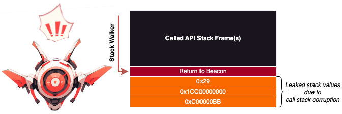

<i>Diagram of detecting shellcode by checking caller's return address</i>

In this call stack below, a sleeping beacon's return address is exposed.

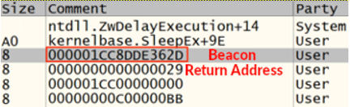

<i>Default beacon with return address exposed in call stack while executing Sleep API</i>

### Evading call stack detection #1 -- Return address spoofing

One way to evade this detection is saving beacon's return address in a non-volatile register before calling an API, then returning to beacon through a ROP gadget in a trusted DLL. Since non-volatile registers are restored by the called API, we can rely on their values persisting through the call.

While checking the return address of the caller, security solutions may be fooled into thinking our stack frame belongs to a trusted DLL API. When our thread finishes executing the called API, it takes a different path than the stack walker. Our thread returns to the gadget, and the gadget jumps our thread back home to beacon.

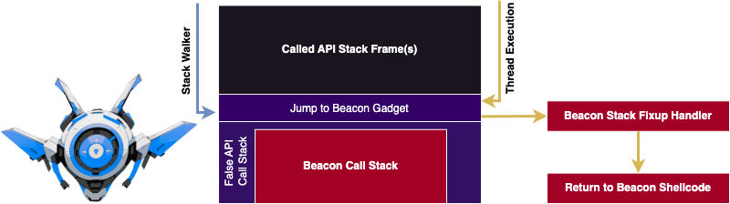

<i>Diagram of evading caller return address detection using return address spoofing</i>

This clever trick was popularized by Namazso in a game hacking forum and then by Kyle Avery in his AceLdr reflective loader project, which he presented at DEFCON 2022.

Like BokuLoader, AceLdr adds call stack spoofing capabilities to beacon by reflectively hooking imported APIs. Before the hook passes execution to the API, beacon's return address is stored on the stack. This stack address is saved into the nonvolatile `RBX` register and a `jmp [rbx]` gadget replaces the caller's return address. To avoid a return address to the hook being pushed onto the stack, the AceLdr hook jumps to the API instead of calling it.

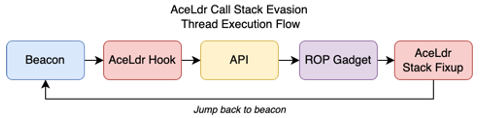

<i>AceLdr Call Stack Evasion Thread Execution Flow</i>

In the call stack below, we see the gadget's return address which resolves to the `WININET` module, instead of a return address to our beacon shellcode.

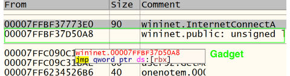

<i>AceLdr beacon call stack with return address spoofing of InternetConnectA API</i>

While examining the AceLdr call stack above, we see it ends prematurely after the gadget stack frame. This is because the return address of the next stack frame is 0. Stack walkers typically walk down the call stack until the next stack frame has a return address of 0.

### Call stack detection #2 -- Truncated call stack

When analyzing a call stack, verify the call stack traces down to common thread start APIs such as `BaseThreadInitThunk` & `RtlUserThreadStart`. Call stack traces that end prematurely are suspicious and could be flagged for further investigation.

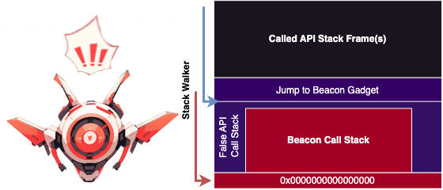

<i>Diagram of a suspicious call stack that uses the call stack truncation evasion</i>

### Evading call stack detection #2 -- Synthetic frames

To evade this call stack tracing detection we can extend the first evasion by pushing fake thread start API frames to the stack. As long as we allocate memory on the stack for our fake frames, we can continue to add frames and avoid overwriting beacon's real call stack.

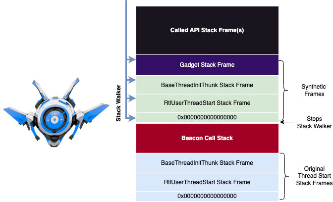

<i>Diagram of evading call stack tracing detections using synthetic frames</i>

Synthetic frames are used in the SilentMoonwalk project as the non-default option and are also used in the Vulcan Raven project.

### Call stack detection #3 -- Hunting for the thread start frame

When analyzing a call stack, verify that the third stack frame from the bottom is a return address to the thread's start address function. If the call stack does not align with the thread's start function, this may be suspicious and warrant further investigation. This detection technique could be leveraged to detect both modes of the SilentMoonwalk project and the new release of BokuLoader.

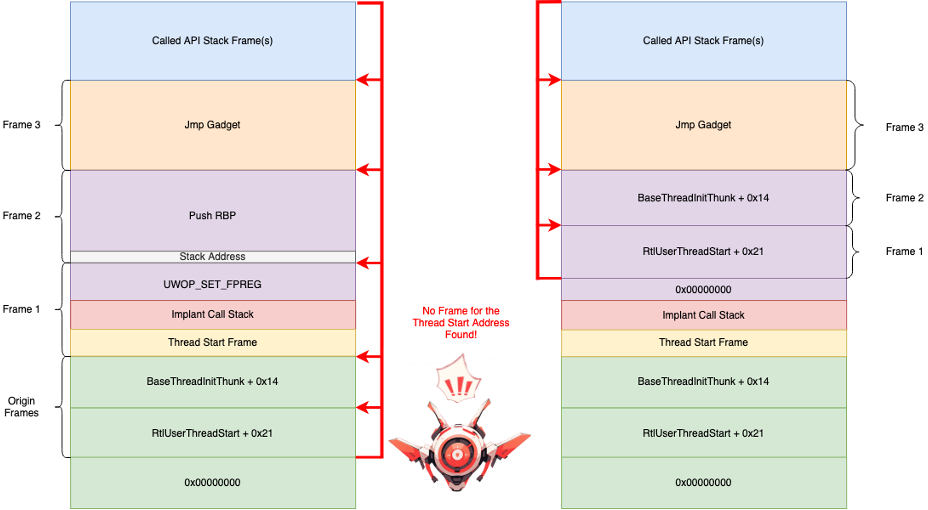

<i>Detecting suspicious call stack due to thread start address frame missing (Desynchronization technique -- left, Synthetic Frame technique -- right)</i>

In the below screenshot we see a thread of `OneDrive.exe` has a start address, which aligns with the third lowest frame in the thread's call stack.

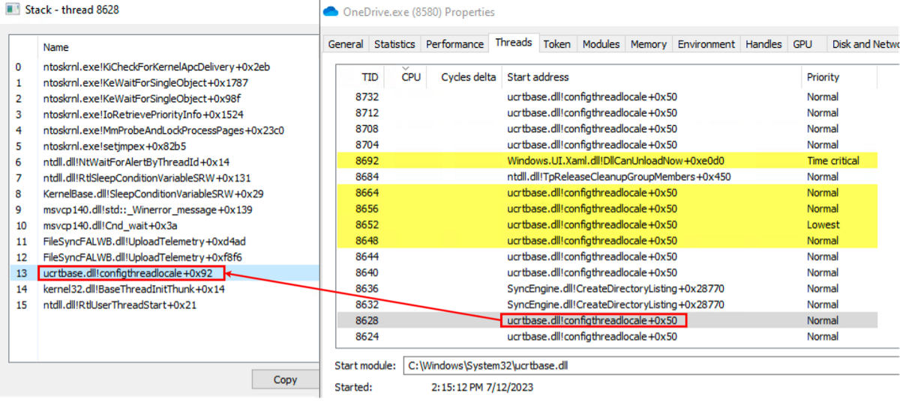

<i>The symbol from a thread's Start Address is normally present on its call stack</i>

This detection will likely result in a lot of false positives if implemented without proper tuning. While typical user programs launched from the desktop follow this pattern, there are many service and background processes that do not. Regardless of the noise, threat hunters and detection engineers may find this detection technique useful while investigating call stack traces.

### Call stack detection #4 -- Hunting for gadgets

All the evasion techniques we have described depend on a `jmp [rbx]` gadget to restore execution to a handler that returns to beacon. However, it is possible to also use other nonvolatile registers such as `rsi` and `rdi`.

## Bokuloader integration

For the public BokuLoader project, we have incorporated the call stack spoofing capabilities of the [LoudSunRun project](https://github.com/susMdT/LoudSunRun) by Dylan Tran. Dylan's project is derived from the SilentMoonwalk and the Vulcan Raven projects. In this release of BokuLoader synthetic stack frames are used to evade call stack detections. The detection methods described in this post should be able to detect a BokuLoader beacon.

Active call stack spoofing has been applied to all `WININET` APIs imported by the Cobalt Strike HTTPS beacon. A hashing method has been included in the BokuLoader project and replaces the previously used string encryption method. This was done to save memory on the stack and avoid potential stack overflows which would crash beacon.

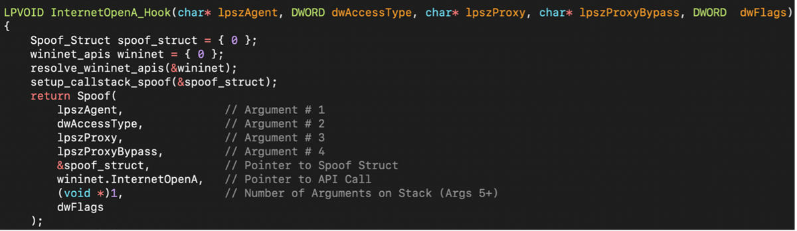

<i>Hook call stack spoof implementation for InternetOpenA</i>

Some direct syscalls in BokuLoader have been replaced by spoofed indirect syscalls. To determine the syscall number, the HalosGate technique is still used. A simple gadget hunter has been added which searches for a syscall gadget within the executable section of the `NTDLL` module.

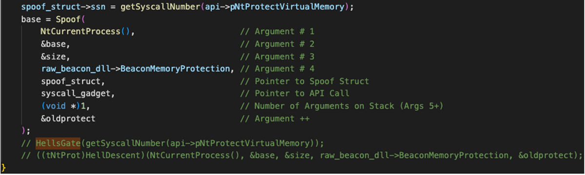

<i>Executing NtProtectVirtualMemory NTAPI via spoofed indirect syscall</i>

## Closing thoughts

We hope you found this post helpful and learned something new about call stack detections and evasions. If you are interested in learning more, check out Dylan's recently released blog post "[An Introduction into Stack Spoofing](/2023-09-15-StackSpoofin/)." Stay tuned for our next post!

## References and resources

* [BokuLoader](https://github.com/boku7/BokuLoader) -- A proof-of-concept Cobalt Strike Reflective Loader that aims to recreate, integrate, and enhance Cobalt Strike's evasion features
* [Behind the Mask: Spoofing Call Stacks Dynamically with Timers](https://www.cobaltstrike.com/blog/behind-the-mask-spoofing-call-stacks-dynamically-with-timers)
* [AceLdr](https://github.com/kyleavery/AceLdr) -- Cobalt Strike UDRL for memory scanner evasion
* [SilentMoonwalk](https://github.com/klezVirus/SilentMoonwalk) -- PoC Implementation of a fully dynamic call stack spoofer
* [Vulcan Raven](https://github.com/WithSecureLabs/CallStackSpoofer) -- PoC implementation for spoofing arbitrary call stacks when making syscalls
* [CallStackMasker](https://github.com/Cobalt-Strike/CallStackMasker) -- A PoC implementation for dynamically masking call stacks with timers
* [LoudSunRun](https://github.com/susMdT/LoudSunRun) -- Call stack synthetic frame spoofer with indirect syscalls
* [ThreadStackSpoofer](https://github.com/mgeeky/ThreadStackSpoofer) -- Thread Stack Spoofing PoC
