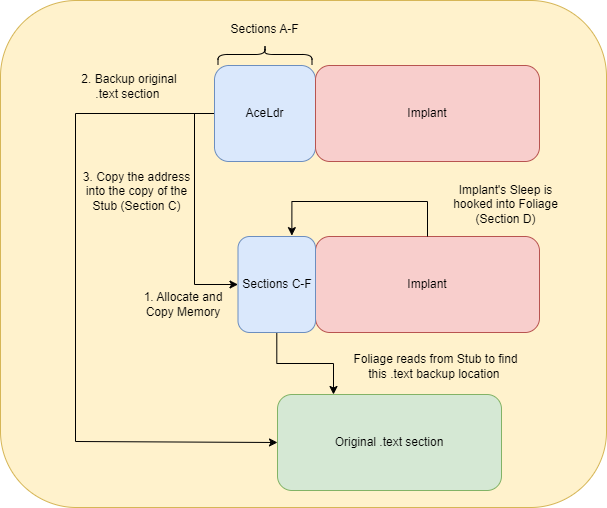
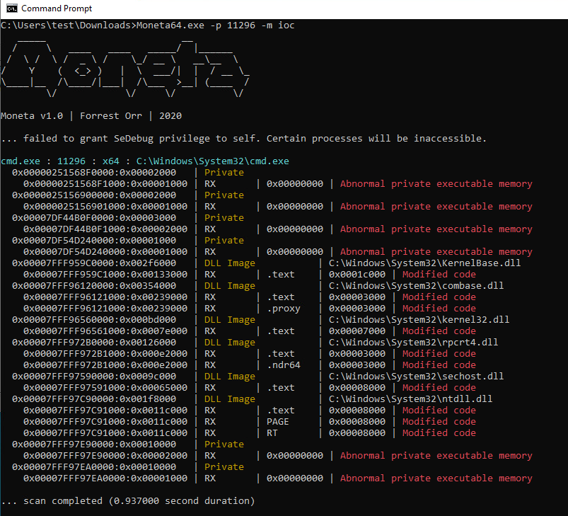
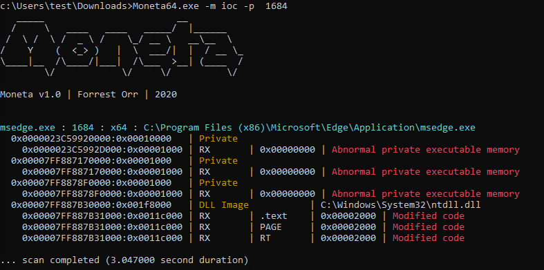

In my last blog post I talked about stack spoofing, a technique used to hide the origin of an API call so as to not point back to our implant in memory. The implementation I went over is a trade-off; at a glance, the stack is clean, but in reality, there are a myriad of IOCs. Namely, the use of gadgets and a misalignment: a stack frame's return address that lacks a preceding call instruction. There is an alternative to this: Module Stomping. The purpose of this post is to discuss and demonstrate both benefits and indicators of compromise (IOCs) that Module Stomping and some of its variants brings to our implants.

# Reviewing Module Stomping
Module Stomping works by loading or mapping a module into memory, overwriting it with our payload (preferrably an R/X section), then executing our payload. First, executing shellcode which calls `MessageBox` by directly executing the memory (function pointer), without stomping:


A basic example using `Chakra.dll` to execute shellcode which calls `MessageBox`:

<br/>

Notice how the call stack of the main thread reveals that `MessageBox` was executed by a private read/executable memory address. Since it is memory that does not pertain to an module mapped from disk, it may be subject to a scan which would reveal the shellcode's contents. However, if we were to execute the same shellcode with Module Stomping, this would be the result:

<br/>

<details style="background-color: #000000; color: #FFFFFF; border-left: 5px solid #00FF00; border-radius: 10px; padding: 10px;">
    <summary>Code Snippet</summary>
    <pre>
        <code style="color: white">
#include &#60;windows.h&#62;
#include &#60;stdio.h&#62;
void main() {

	unsigned char Shellcode[] = //msfvenom -p windows/x64/messagebox TEXT=hi TITLE=hi -f c EXITFUNC=thread

	PIMAGE_DOS_HEADER Dos	  = NULL;
	PIMAGE_NT_HEADERS Nt	  = NULL;
	PIMAGE_SECTION_HEADER Txt = NULL;

	PVOID pTxt     = NULL;
	DWORD SzTxt	   = 0;
	DWORD OldProt  = 0;
	
	Dos = ( PIMAGE_DOS_HEADER )  LoadLibraryExA( "Chakra.dll", NULL, DONT_RESOLVE_DLL_REFERENCES );
	Nt  = ( PIMAGE_NT_HEADERS )  ( ( ( PBYTE ) Dos ) + Dos->e_lfanew );
	Txt = IMAGE_FIRST_SECTION( Nt ); 

	pTxt  = ( ( PBYTE ) Dos ) + Txt->VirtualAddress;
	SzTxt = Txt->Misc.VirtualSize;

	VirtualProtect( pTxt, SzTxt, PAGE_EXECUTE_READWRITE, &OldProt );
	memcpy( pTxt, Shellcode, sizeof(Shellcode) );
	VirtualProtect( pTxt, SzTxt, PAGE_EXECUTE_READ, &OldProt );

	// Idk how to actually do a clean looking function pointer execute
	typedef void* (*vpexec)();
	vpexec exec = ( vpexec ) pTxt;
	exec();

}
        </code>
    </pre>
</details>

Our call stack does not show indications of unbacked R/X memory anymore; all return addresses are able to be resolved to an offset of a loaded module. However there is a significant IOC: checking the bytes between the module's sections in memory and on-disk would reveal that the bytes have been modified! PE-Sieve can help identify this; it compares the bytes of a module on disk to the module in memory. While it does this to detect inline hooks, this can double as a Module Stomping deteciton.

<br/>

# Advanced Module Stomping
Module Stomping was improved upon by different projects such as [ModuleShifting](https://github.com/naksyn/ModuleShifting), [Sweet Dreams](https://github.com/CognisysGroup/SweetDreams), and [Brute Ratel](https://bruteratel.com/release/2023/03/19/Release-Nightmare/)'s sleep implementation. The improved technique, which seems to be referred to as "Advanced Module Stomping" most commonly, restores the original contents of the stomped module after execution. By restoring our the original module's memory after execution, we no longer get flagged by PE-Sieve.

<br/>

GGEZ I'm going to bypass EDR? Nah. There's actually another significant IOC, but before I talk about that, it's important to note that the code we've used thus far is simple; a small loader that runs simple shellcode. What if we wanted to go bigger -- an implant perhaps? There's a lot more complications that come with this. 2 glaring issues with implementing a loader which uses Advanced Module Stomping to hide implant call stacks:

* They are often reflectively loaded -- if our loader simply executes implant shellcode, the implant will actually just reflectively load itself into unbacked memory! There goes our hard work.  
* They persist in memory -- how can we restore a module's code without crashing the implant?  

So what now? These were questions I had at the beginning of this year, but then Brute Ratel's Nightmare release came out in March and was capable of overcoming these. Currently, to my awareness, there is no open source project that does this. This next phase of the blog will be focused around how I implemented Advanced Module Stomping in a reflective loader. If you're only interested in the IOCs of the technique, skip towards the bottom of this post.

# Credits
Before I go any further, major credit is due to Chetan, Kyle, and Austin. My POC is essentially AceLdr, with Advanced Module Stomping implemented via slight modifications to Foliage sleep obfuscation. This wouldn't be possible without [Kyle](https://github.com/kyleavery/AceLdr) and [Austin](https://github.com/realoriginal/titanldr-ng)'s work. Chetan's [blog post](https://bruteratel.com/release/2023/03/19/Release-Nightmare/) about the topic was also incredibly useful in troubleshooting a lot of issues I had. Also, massive thanks to [Bakki](https://twitter.com/shubakki) for helping me understand the structure of AceLdr so I could actually implement the technique.

# Foliage
The first issue isn't too much of an issue; if we're worried that the reflective loader of our implant will reflectively load itself into private memory, we can simply create and implement our own reflective loader and prepend it to an implant in DLL format. But what about the second issue? Sleep obfuscation techniques faced a similar issue: how do you encrypt a running implant in memory without crashing it? This was addressed by using timers and APCs in the form of [Ekko](https://github.com/Cracked5pider/Ekko/) and [Foliage](https://github.com/realoriginal/foliage). I ended up forking AceLdr, which implemented Foliage, and modified the thread contexts to support sleep obfuscation. Foliage was implemented via an Import Address Table (IAT) hook on the `Sleep` API, so an implant would use Foliage rather than a normal sleep call.

With that being said, a quick rundown on the Foliage sleep technique.

* Create a suspended thread (Thread A) with a comedically large stack. The thread start address will be on RtlUserThreadStart + 0x21
* Capture Thread A's context
* Copy that context into a comedic amount of thread contexts
* Change most of the contexts' RIP/rcx/rdx/etc to point to different API calls and argument values
    * With the large stack, we can offset each context to include room for stack args (5+ args)
    * Our contexts will make implant R/W => encrypt => spoof implant thread context => decrypt => fix context => make implant R/X => continue normal execution
* Queue up a bunch of APCs on Thread A to execute NtContinue, passing our contexts as the argument
* Signal Thread A to execute our APCs and magic happens

If you want more on sleep obfuscation, read my other [blog post](https://dtsec.us/2023-04-24-Sleep/) (shameless plug).

We can simply modify the contexts to restore a stomped module's .text section before rest, and restore implant after rest, rather than encrypting implant. However, it gets a little tricky because that means we need to back up the original .text section of the stomped module along with our implant. This is would done during reflective loading because by the time implant is running, the module would already stomped. This would mean our sleep IAT hook would have to be aware of the address of the backup, along with the size of the respective data. We'll have to mod AceLdr up a bit to make this work.

# Modding AceLdr
Understanding how to pass information gathered/created from the reflective loading process, to our implant (in this case, its IAT hooks) will be important. Shoutout again to bakki for helping me understand how AceLdr did this. AceLdr makes the linker compile code into a certain layout via a linker script. Note that only the .text and .rdata sections are linked because we want our reflective loader to be R/X, so there will be no writeable section.

```
SECTIONS
{
    .text :
    {
        *( .text$A )
        *( .text$B )
        *( .text$C )
        *( .text$D )
        *( .text$E )
        *( .rdata* )
        *( .text$F )
    }
}
```
To indicate which .text section our executable code will be compiled to, the `SECTION( [A-F] )` macro is used. Keep in mind this is specifically for the `mingw` compiler. For example, the following code for the `copyStub` function will be located at the "B" section of `.text`

```
SECTION( B ) VOID copyStub( PVOID buffer )
{   
    PVOID Destination   = buffer;
    PVOID Source        = C_PTR( OFFSET( Stub ) );
    DWORD Length        = U_PTR( G_END() - OFFSET( Stub ) );

    memcpy( Destination, Source, Length );
};
```

The way the code was set up results in the following organization:

* .text$A - Start (Shellcode entrypoint)
* .text$B - Reflective Loader functions
* .text$C - Stub (Also referred to as Table)
* .text$D - IAT Hooks, including Foliage
* .rdata  - yeah
* .text$F - GetIp

During reflective loading, AceLdr copies sections C to F into the memory it allocated, then it copies and maps the implant. The memory the implant is mapped into is a module's memory, loaded via `LdrLoadDll`. The module's memory is backed up into a memory page prior to being stomped. An encryption key is generated and used to encrypt this backup page (why not?). This key is copied into the Stub copy, so Foliage can access it and decrypt the page. The Stub copy will also contain data pertaining to the location and size of the backup page, so Foliage will be able to encrypt, decrypt, and move memory properly during sleep. The original instance of AceLdr is then freed from memory based on the Cobalt Strike profile. The IAT hooks written during the reflective loading process point to the the copied instance of section D, rather than the original loader (since it was freed, else our implant would crash). An attempt at diagramming this is below.

<br/>

# Showtime
I'm using a normal staged shellcode loader. The AceLdr fork I wrote is available [here](https://github.com/susMdT/AceLdr/). Foliage now uses 21 thread contexts 💀. 17 are used for execution. The order and what they execute is:

1. NtWaitForSingleObject - Waits for an event to be signalled to start the rest of the execution
2. NtProtectVirtualMemory - Make the current page (C-F + implant) R/W
3. SystemFunction032 - Decrypt the backup page
4. RtlCopyMemory - Copy the implant to the backup page
5. RtlCopyMemory - Copy the original, decrypted .text section back
6. SystemFunction032 - Encrypt the backed up implant.
7. NtProtectVirtualMemory - Make the current page R/X -- like how the module originally was
8. NtGetContextThread - Back up the implant's main thread thread context
9. NtSetContextThread - Overwrite the implant's main thread context with a fake one -- spoofing at rest
10. Sleep - Actually sleep
11. NtProtectVirtualMemory - Make the current page R/W
12. RtlZeroMemory - Zero the current page
13. RtlCopyMemory - Copy encrypted beacon into current page
14. SystemFunction032 - Decrypt current page
15. NtSetContextThread - Restore implant's original main thread context
16. NtProtectVirtualMemory - Make some of current page R/X. The part staying R/W is the part of the implant which is supposed to be R/W
17. RtlExitUserThread - Exit this sacrificial thread

There is probably a simpler way to go about this, but it's what my scuffed code cooked up. Let's see some results now. 

<div style="display: flex; justify-content: center; align-items: center;">
    <iframe width="100%" height="630" src="https://www.youtube-nocookie.com/embed/koH1VP3fWr8" frameborder="0" allowfullscreen></iframe>
</div>

Absolutely massive. GGEZ I'm going to bypass EDR? Still nah... maybe? I've left out Moneta because it still flags us! 

<br/>

The unsigned module is my loader, so that is to be expected. But what about this "Modified Code" stuff? How is it modified if I restored the original contents?

# The IOCs
Shareable Working Set and SharedOriginal have been the pain of my existence. They are columns I've mostly ignored on Process Hacker until now. But what are they? To my awareness:

* Shared Working Set is the number of bytes this particular page of memory is using that is shared. To not waste memory, some of it is shared. For example, ntdll is loaded into all processes and uses the same physical memory. If this shared memory is written to, the process gets a private copy of the memory page and additional physical memory is used for this.
* `SharedOriginal` is a flag of a memory page that indicates whether this page is the original mapping. This flag is set to 0 when the page is written to because it would then be a copy of the original page, but modified.

Shared Working Set is what Moneta flagged me on. However, Austin managed to find a way around it, by cloning a process. I believe this is due to cloning utilizing `NtMapViewOfSection` when mapping memory to the child, thus causing our stomped module page to regain the shared bytes. However, this will not restore SharedOriginal. One way I think this can be done is by unloading the module and remapping/reloading it, but this would generate TONS of image load events, on top of the thread creation events Foliage already creates. 

While this detection is very formidable, there is a lot of noise that comes with it. For example, any AV/EDR that utilizes hook will have their fair share of "Modified Code"; patching ntdll causes a private memory copy and a loss of `SharedOriginal`.

<br/>

Additionally, some processes, like Edge, just seem to be doing weird stuff.

<br/>

If AV/EDR developers are able to allowlist the lack of SharedOriginal and/or Shared Working Set on their hooked modules, I think this detection might be an effective one, since the modules being stomped would theoretically stand out. I haven't tested enough nor do I have enough experience to make a judgement on that. [Forrest's blog post](https://www.forrest-orr.net/post/masking-malicious-memory-artifacts-part-ii-insights-from-moneta) contains more details about his experience with this detection.

# Conclusion
By modifying sleep obfuscation techniques, we can implement an improved module stomping in our implants. This would serve as an alternative to call stack spoofing, as our implant is now image backed and has less of a need to hide the origin of its API calls. 

I think this is a cool technique and I had a lot of fun trying to figure it out. I do feel mixed about my current implementation as, on one hand, I think it's really cool and maybe effective; it is image backed and looks completely normal during rest. However, with the SharedOriginal and Shared Working Set detections being on my radar now, I don't imagine it being very difficult for this POC to just end up being a trade of one IOC (implant call stacks) for another.

# More Credits and Resources
* [BRC4 1.5](https://bruteratel.com/release/2023/03/19/Release-Nightmare/)
* [Sillyware Developer](https://twitter.com/shubakki)
* [Sharing to share](https://twitter.com/ilove2pwn_/status/1728817143704113433)
* [SharedOriginal](https://windows-internals.com/understanding-a-new-mitigation-module-tampering-protection/)