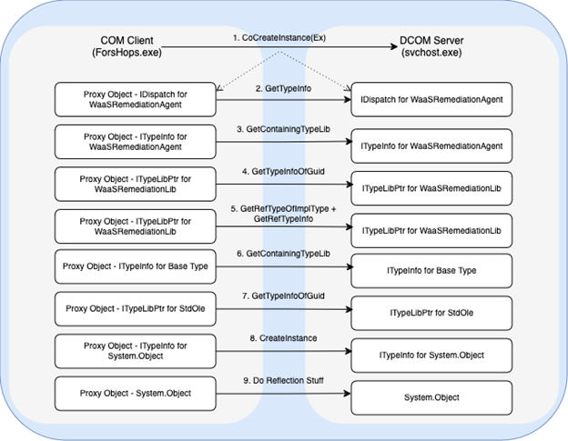
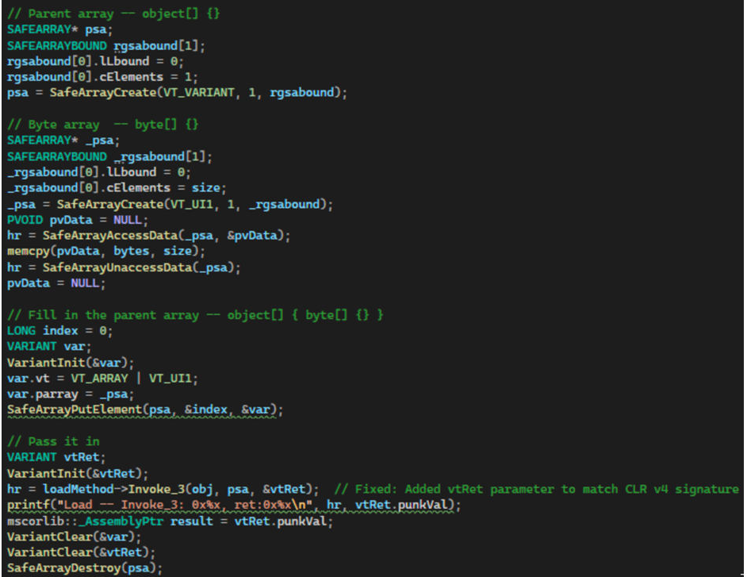
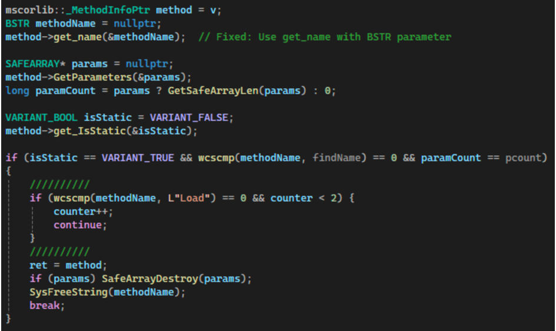
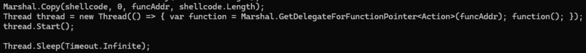
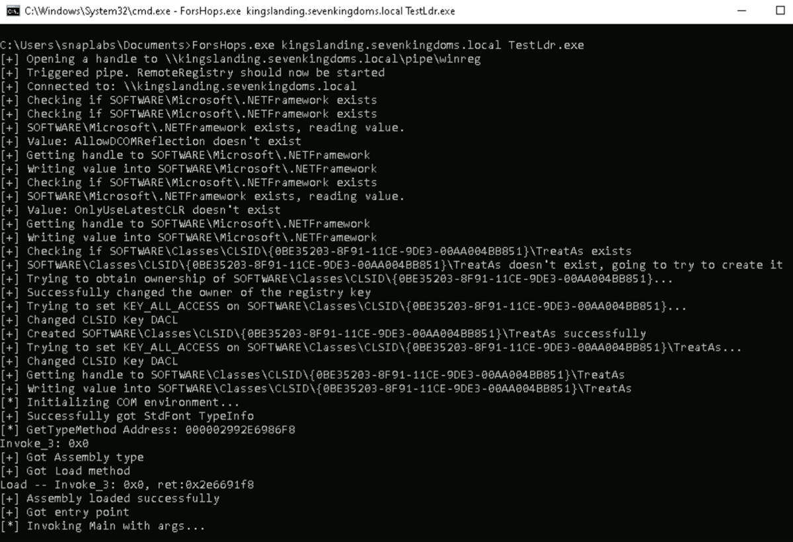
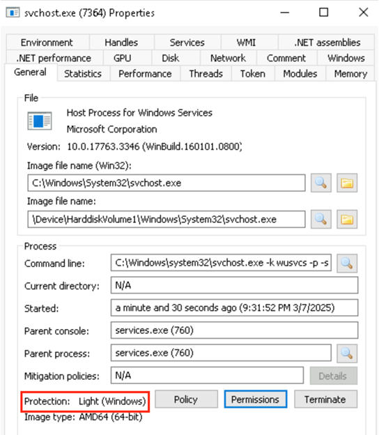
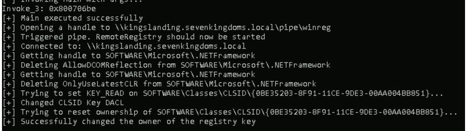

<p style="border-left: 0.3125rem solid #dad42b; padding: 0.625rem 1.25rem; color: #ffffff;"><strong>Authors:</strong> Dylan Tran and Jimmy Bayne (<a href="https://x.com/bohops" style="color: #dad42b;">@bohops</a>)<br><strong>Disclaimer:</strong> This post was originally published on the <a href="https://www.ibm.com/think/news/fileless-lateral-movement-trapped-com-objects" style="color: #dad42b;">IBM Security Blog</a> and has been mirrored here.</p>

Component Object Model (COM) has been a cornerstone of Microsoft Windows development since the early 1990s and is still very prevalent in modern Windows operating systems and applications. The reliance on COM components and extensive feature development through the years has created a generous attack surface. In February 2025, James Forshaw ([@tiraniddo](https://x.com/tiraniddo)) of Google Project Zero released [a blog post](https://googleprojectzero.blogspot.com/2025/01/windows-bug-class-accessing-trapped-com.html) detailing a novel approach for abusing Distributed COM (DCOM) remoting technology where trapped COM objects can be used to execute .NET managed code in the context of a server-side DCOM process. Forshaw highlights several use cases for privilege escalation and Protected Process Light (PPL) bypass.

Based on Forshaw's research, Mohamed Fakroud ([@T3nb3w](https://x.com/T3nb3w/)) [published](https://github.com/T3nb3w/ComDotNetExploit) an implementation of the technique to bypass PPL protections in early March 2025. Jimmy Bayne ([@bohops](https://x.com/bohops)) and I conducted similar research in February 2025, which has led us to develop a proof-of-concept fileless lateral movement technique by abusing trapped COM objects.

## Background

COM is a binary interface standard and a middleware service tier that allows for the exposure of distinct, modular components to interact with each other and with applications, regardless of the underlying programming language. For instance, COM objects developed in C++ can easily interface with a .NET application, enabling developers to integrate diverse software modules effectively. DCOM is a remoting technology that enables COM clients to communicate with COM servers via inter-process communication (IPC) or remote procedure calls (RPC). Many Windows services implement DCOM components that are locally or remotely accessible.

COM classes are typically registered and contained within the Windows Registry. A client program interacts with a COM server by creating an instance of the COM class, known as a COM object. This object provides a pointer to a standardized interface. The client uses this pointer to access the object's methods and properties, facilitating communication and functionality between the client and server.

COM objects are often research targets for assessing vulnerability exposure and discovering abusable features. A trapped COM object is a bug class in which a COM client instantiates a COM class in an out-of-process DCOM server, where the client controls the COM object via a marshaled-by-reference object pointer. Depending on the condition, this control vector may present security-related logic flaws.

Forshaw's blog describes a PPL bypass use case where the `IDispatch` interface, as exposed in the `WaaSRemediation` COM class, is manipulated for trapped COM object abuse and .NET code execution. `WaaSRemediation` is implemented in the `WaaSMedicSvc` service, which executes as a protected `svchost.exe` process in the context of NT AUTHORITY\SYSTEM. Forshaw's excellent walkthrough was the basis for our applied research and development of a proof-of-concept fileless lateral movement technique.

## Research overview

Our research journey began by exploring the `WaaSRemediation` COM class that supports the `IDispatch` interface. This interface allows clients to perform [late binding](https://learn.microsoft.com/us-en/previous-versions/office/troubleshoot/office-developer/binding-type-available-to-automation-clients). Normally, COM clients have the interface and type definitions for the objects they are using defined at compile time. Instead, late binding permits the client to discover and call methods upon the object at runtime. `IDispatch` includes the `GetTypeInfo` method, which returns an `ITypeInfo` interface. `ITypeInfo` has methods that can be used to discover type information for the object implementing it.

If a COM class uses a type library, it can be queried by the client via `ITypeLib` (obtained from `ITypeInfo->GetContainingTypeLib`) to retrieve type information. Additionally, type libraries may also reference other type libraries for additional type information.

According to Forshaw's blog post, `WaaSRemediation` references the type library `WaaSRemediationLib,` which in turn references `stdole` (OLE Automation). `WaaSRemediationLib` utilizes two COM classes from that library, `StdFont` and `StdPicture`. By performing [COM Hijacking](https://bohops.com/2018/08/18/abusing-the-com-registry-structure-part-2-loading-techniques-for-evasion-and-persistence/) on the `StdFont` object via modifying its `TreatAs` registry key, the class will point to another COM class of our choosing, such as `System.Object` in the .NET Framework. Of note, Forshaw points out that `StdPicture` is not viable as this object performs a check for out-of-process instantiation, so we kept our focus on using `StdFont`.

.NET objects are interesting to us because of `System.Object`'s `GetType` method. Through `GetType,` we can perform .NET reflection to eventually access `Assembly.Load`. While `System.Object` was chosen, this type happens to be the root of the type hierarchy in .NET. Therefore, any .NET COM object could be used.

With the initial stage set, there were two other DWORD values under `HKLM\Software\Microsoft\.NetFramework` key required to make our perceived use case a reality:

* `AllowDCOMReflection`: [As noted](https://googleprojectzero.blogspot.com/2025/01/windows-bug-class-accessing-trapped-com.html#h.3v9u0s1gnv0c) by Forshaw, this enabled value allows us to perform arbitrary reflection for calling any .NET method. Typically, .NET Reflection over DCOM is prevented due to mitigations addressed in [MS14-009](https://support.microsoft.com/us-en/topic/marshaling-of-reflection-types-may-not-work-over-dcom-after-you-install-a-security-update-from-security-bulletin-ms14-009-b3ae0bd6-fb65-4e75-b399-0add119cc16f).
* `OnlyUseLatestCLR`: Using Procmon,** we've discovered this value must be enabled to load the latest version of the .NET CLR (version 4), else version 2 is loaded by default.

Upon confirming that the latest version of the CLR and .NET could be loaded in our initial testing efforts, we knew we were on the right track.

## From local process to remote computer

Shifting our attention to focus on remote programmatic aspects, we first used **Remote Registry** to manipulate the `.NetFramework` registry key values and hijack the `StdFont` object on the target machine. Next, we swapped `CoCreateInstance` for `CoCreateInstanceEx` to instantiate the `WaaSRemediation` COM object on the remote target and get a pointer to the `IDispatch` interface.

With a pointer to `IDispatch`, we call the `GetTypeInfo` member method to get a pointer to the `ITypeInfo` interface, which is trapped in the server. Member methods called thereafter occur server-side. After identifying the contained type library reference of interest (`stdole`) and deriving the subsequent class object reference of interest (`StdFont`), we eventually used the "remotable" `CreateInstance` method on the `ITypeInfo` interface to redirect the `StdFont` object link flow (via prior `TreatAs` manipulation) to instantiate `System.Object`.

Since `AllowDCOMReflection` is properly set, we can then perform .NET reflection over DCOM to access `Assembly.Load` to load a .NET assembly into the COM server. Since we're using `Assembly.Load` over DCOM, this lateral movement technique is completely fileless as the assembly byte transfer is handled by the DCOM remoting magic. For an in-depth explanation of this technical flow from object instantiation to reflection, please refer to the following diagram:


<center><i>System.Object Class Instantiation Flow</i></center>

## Development pains

Our first and primary issue was calling `Assembly.Load_3`, via `IDispatch->Invoke`. `Invoke` passes an object array of arguments to the target function, and `Load_3` is the overload of `Assembly.Load` that takes a single byte array. Thus, we needed to wrap the `SAFEARRAY` of bytes within another `SAFEARRAY` of `VARIANT`s -- initially, we kept trying to pass a single `SAFEARRAY` of bytes.


<center><i>Creating an unmanaged equivalent of Object Byte</i></center>

Another issue was finding the proper `Assembly.Load` overload. Helper functions were taken from Forshaw's CVE-2014-0257 [code](https://github.com/tyranid/IE11SandboxEscapes/blob/master/CVE-2014-0257/CVE-2014-0257.cpp), which included the `GetStaticMethod` function. This function used .NET reflection over DCOM to find a static method given a type pointer, the method name and its parameter count. `Assembly.Load` has two static overloads that take a single argument; as such, we ended up using a hacky solution. We noticed the third instance of `Load` with a single argument was our right pick.


<center><i>Hunting for the proper Assembly.Load overload</i></center>

## Operational pains

One of the biggest drawbacks we observed with this technique was that the beacon spawned would have its lifetime limited to the COM client; in this case, the application lifetime of our weaponization binary "ForsHops.exe" (elegantly named, of course). So, if ForsHops.exe cleaned up its COM references or exited, so would the beacon that was running under the remote machine's svchost.exe. We tried different solutions, such as having our .NET assembly indefinitely hang its main thread, execute shellcode in another thread and have ForsHops.exe leave the exploit thread hanging, but nothing was elegant.


<center><i>.NET loader main thread hangs while shellcode runs in separate thread</i></center>

In its current state, ForsHops.exe runs until the beacon exits, at which point it removes its registry operations. There are opportunities for improvement, but we'll leave that as an exercise for the reader.


<center><i>ForsHops.exe execution</i></center>


<center><i>Successful beacon on Windows 2019 Server</i></center>


<center><i>Beacon runs in a PPL svchost process</i></center>


<center><i>ForsHops.exe removing changes after beacon exits</i></center>

## Defensive recommendations

The detection [guidance](https://x.com/SBousseaden/status/1896527307130724759) proposed by Samir Bousseaden ([@SBousseaden](https://x.com/SBousseaden)) after Mohamed Fakroud published their implementation also applies to this lateral movement technique:

* Detecting CLR load events within the `svchost.exe` process of `WaaSMedicSvc`
* Detecting Registry manipulation (or creation) of the following key: `HKLM\SOFTWARE\Classes\CLSID\{0BE35203-8F91-11CE-9DE3-00AA004BB851}\TreatAs` (`TreatAs` key of StandardFont CLSID)

Furthermore, we recommend implementing the following additional controls:

* Detecting DACL manipulation of `HKLM\SOFTWARE\Classes\CLSID\{0BE35203-8F91-11CE-9DE3-00AA004BB851}`
* Hunting for the presence of enabled `OnlyUseLatestCLR` and `AllowDCOMReflection` values in `HKEY\LOCAL\MACHINE\SOFTWARE\Microsoft\.NETFramework`
* Enabling the host-based firewall to restrict DCOM ephemeral port access where possible

Additionally, leverage the following proof-of-concept YARA rule to detect the standard ForsHops.exe executable:

```text
rule Detect_Standard_ForsHops_PE_By_Hash
{
    meta:
        description = "Detects the standard ForShops PE file by strings"
        reference = "GitHub Project: https://github.com/xforcered/ForsHops/"
    strings:
        $s1 = "System.Reflection.Assembly, mscorlib" wide
        $s2 = "{72566E27-1ABB-4EB3-B4F0-EB431CB1CB32}" wide
        $s3 = "{34050212-8AEB-416D-AB76-1E45521DB615}" wide
        $s4 = "GetType" wide
        $s5 = "Load" wide

    condition:
        all of them
}
```

## Conclusion

Our implementation slightly extends the COM abuse explained in Forshaw's blog by leveraging trapped COM objects for lateral movement rather than local execution for PPL bypass. Therefore, it is still susceptible to the same detections as implementations performing local execution.

You can find the ForsHops.exe proof-of-concept lateral movement code [here](https://github.com/xforcered/ForsHops).

## Acknowledgements

A special thank you to Dwight Hohnstein ([@djhohnstein](https://x.com/djhohnstein)) and Sanjiv Kawa ([@sanjivkawa](https://x.com/sanjivkawa)) for giving feedback on this research and providing blog post content review.
